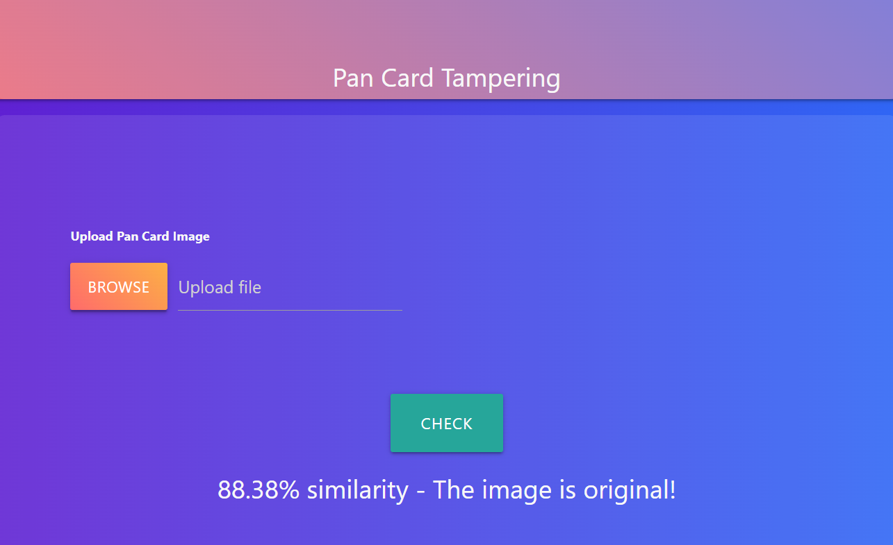

# PAN Card Tempering Detector

This project is a Flask web application designed to detect tempering in PAN card images. The application allows users to upload images of PAN cards and uses image processing techniques to determine if the card has been tampered with.

## Steps to Run the Application

### Step 1: Clone the Project
Clone the repository to your local machine.

### Step 2: Navigate to the Project Directory
Open a command prompt and change your current path to the folder where you can find the `app.py` file.

### Step 3: Create a Virtual Environment
Create a virtual environment using the command below:

```
conda create -name <environment_name>
```

### Step 4: Activate the Virtual Environment
Activate the environment with the following command:

```
conda activate <environment_name>
```


### Step 5: Install Required Dependencies
Use the command below to install the required dependencies:

```
python -m pip install -r requirements.txt
```

### Step 6: Run the Application
Run the application using the command:

```
python app.py
```

You will get a URL. Copy it and paste it into your browser to access the web application.

### Step 7: Test with Sample Data
You have a `sample_data` folder where you can find images to test the application.

## Screenshot


## Project Structure
- `app/`: Contains the main application code.
  - `__init__.py`: Initializes the Flask app.
  - `views.py`: Contains the view functions/routes.
  - `templates/`: Contains HTML templates.
- `config.py`: Configuration file for the Flask app.
- `requirements.txt`: Lists the dependencies required for the project.
- `app.py`: The main entry point of the application.

## License
This project is licensed under the MIT License.

## Acknowledgements
- Flask documentation
- OpenCV documentation
- Any other resources or libraries used

## Deployment

You can view the live application [here](https://pan-card-tempering-detector-app.onrender.com/).
